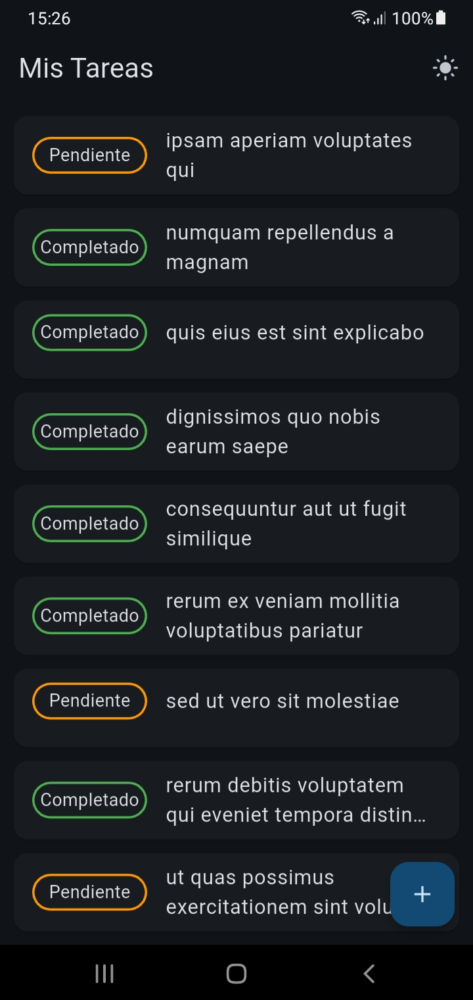
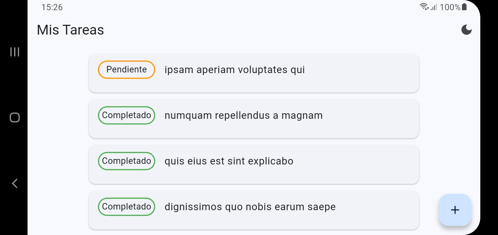
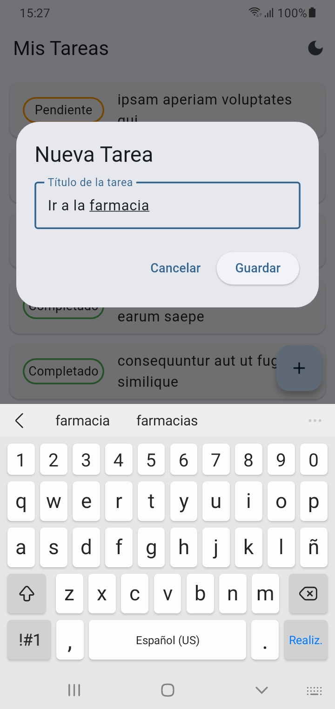
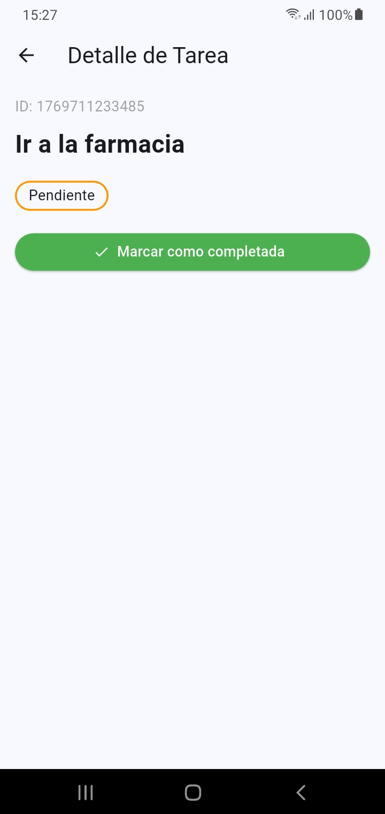

# Prueba técnica de TODO app

## Vista Previa de la Aplicación

| Listado | Listado (horizontal) |
|:---:|:---:|
|  |  |

| Formulario de creación | Detalle |
|:---:|:---:|
|  |  |

## Instrucciones para ejecutar el proyecto

1. Clona el proyecto e instala las dependencias:
    ```bash
    git clone https://github.com/juanmadev5/pt_todo_app
    cd pt_todo_app
    flutter pub get
    ```
2. Conecta un dispositivo y luego ejecuta la aplicación 
    ```bash
    flutter run
    ```

## Estructura del proyecto

```bash
lib/
 ├── core/
 │    └── colors.dart
 ├── data/
 │    ├── datasources/
 │    │    ├── local_data_source.dart
 │    │    └── todo_data_source.dart
 │    ├── models/
 │    │    └── task_model.dart
 │    └── repositories/
 │         └── task_repository_impl.dart
 ├── domain/
 │    ├── entities/
 │    │    └── task_entity.dart
 │    ├── repositories/
 │    │    └── task_repository.dart
 │    └── usecases/
 │         ├── get_tasks_use_case.dart
 │         └── save_task_use_case.dart
 ├── presentation/
 │    ├── components/
 │    │    └── state_chip.dart
 │    ├── detail/
 │    │    └── detail_page.dart
 │    └── home/
 │         ├── bloc/
 │         │    ├── home_cubit.dart
 │         │    ├── home_state.dart
 │         │    └── theme_cubit.dart
 │         └── home_page.dart
 └── main.dart
tests
 └── domain/usecases/
       └── task_test.dart
 ```

## Librería utilizadas
Se seleccionaron las siguientes librerías para garantizar un desarrollo robusto, escalable y alineado con los requisitos técnicos.
1. [`flutter_bloc`](https://pub.dev/packages/flutter_bloc): Utilizado para la gestión de estados (Cubit). Permite una separación estricta entre la lógica de negocio y la interfaz de usuario.
2. [`http`](https://pub.dev/packages/http): Cliente para realizar las peticiones a la API de [JSONPlaceholder](https://jsonplaceholder.typicode.com/todos).
3. [`shared_preferences`](https://pub.dev/packages/shared_preferences): Implementado para la persistencia local de tareas, permitiendo que la aplicación funcione en modo offline.
4. [`mockito`](https://pub.dev/packages/mockito): Utilizado para poder mockear dependencias y hacer tests.

## Decisiones técnicas tomadas

1. Excluimos el `userId` devuelto por la API de por no ser imprescindible para esta app.

2. Uso clases para los `use cases` ya que al pasarle el repositorio por el constructor, estos pueden ser mockeados para realizar tests unitarios.

3. Se decidió usar inyeccion manual ya que la app es pequeña.

4. Estrategia de caché: Al abrir la app se prioriza la carga desde el almacenamiento local. Solo se realizan peticiones a la API durante el primer inicio o cuando el usuario solicita explícitamente una actualización mediante Pull to Refresh.

## Mejoras posibles con más tiempo
Aunque la aplicación cumple con todos los requisitos técnicos y funcionales solicitados, existen áreas de mejora que podrían elevar la calidad del producto en una fase posterior:

- **Implementación de Equatable o Freezed:** Para optimizar la comparación de estados en BLoC.

- **Inyección de Dependencias con GetIt:** A medida que la app crezca, sustituir la inyección manual por un contenedor de dependencias como `GetIt` para centralizar la configuración de servicios y repositorios.

- **Tests de UI y de Integración:** Añadir Widget Tests para asegurar que los componentes de la interfaz responden correctamente y Integration Tests para validar el flujo completo desde la carga de datos hasta la navegación.

- **Diseño UX Mejorado:** Añadir notificaciones tipo Toast para confirmar acciones y soporte para múltiples idiomas (`i18n`).
